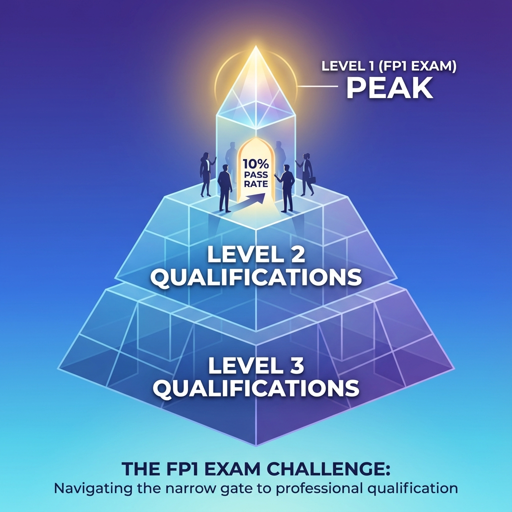
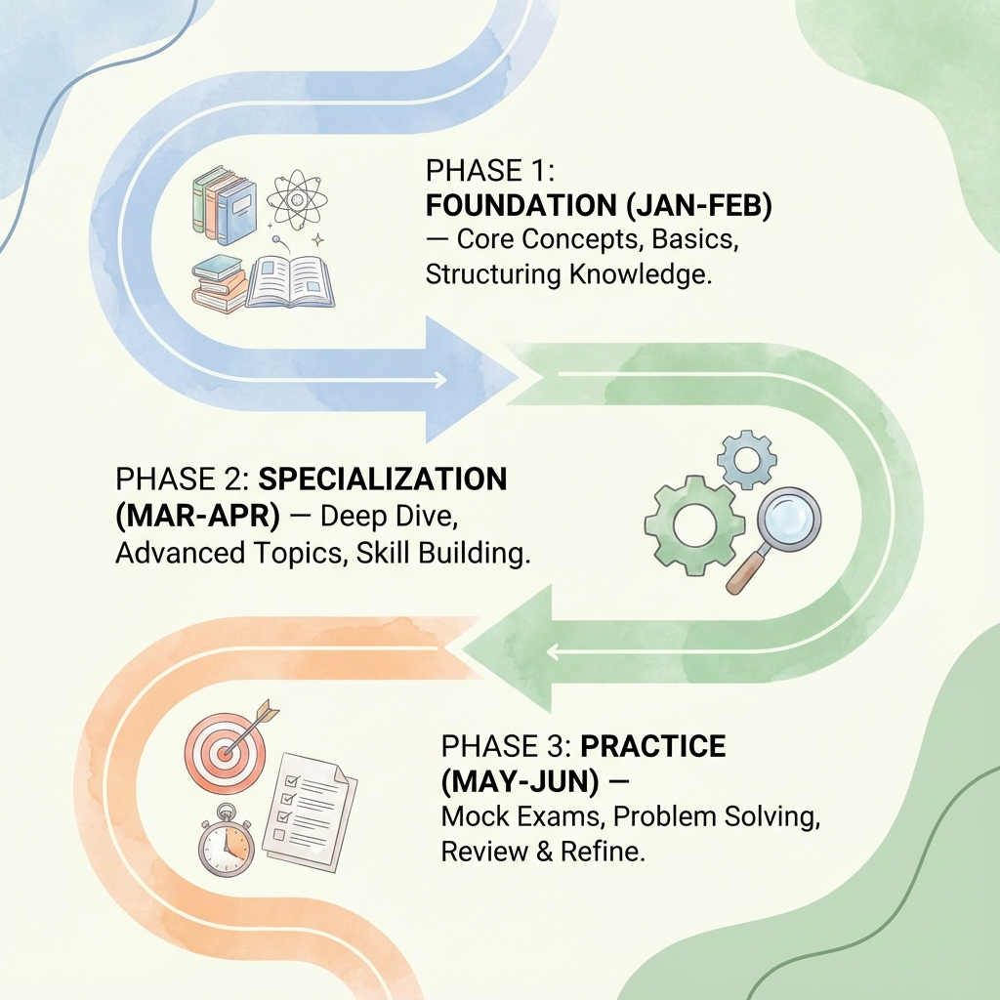
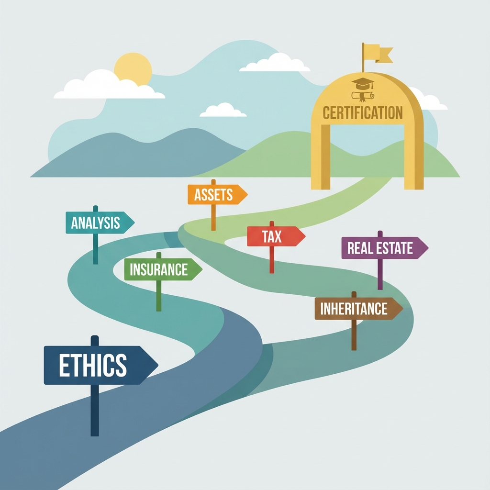

# 【連載開始】FP1級取得への道：現役受験生が解説する試験範囲完全攻略

## はじめに：なぜ今、FP1級なのか

皆さん、こんにちは。現在FP1級の勉強に奮闘している一受験生です。FP2級を取得してから約3年、実務経験を積みながら「もっと深い知識でクライアントに貢献したい」という思いから、ついにFP1級の挑戦を決意しました。

FP1級は、日本のファイナンシャル・プランニング分野における最高峰の資格。単なる知識の集大成ではなく、お客様の人生に寄り添い、最適な財務戦略を提案できる真のプロフェッショナルになるための登竜門です。

この連載では、私自身の学習過程をリアルタイムで共有しながら、FP1級の試験範囲を一つずつ丁寧に解説していきます。教科書的な説明だけでなく、実務での活用方法や覚え方のコツ、過去問の傾向分析など、受験生ならではの視点でお届けします。

## FP1級の位置づけと難易度

### 資格の概要

まず基本情報からおさらいしましょう。FP1級は制度が少し複雑なので注意が必要です。

- **学科試験**：
    - **実施団体**：きんざい（金融財政事情研究会）のみ
    - **実施時期**：年3回（1月・5月・9月）
- **実技試験**：
    - **きんざい**：年2～3回実施（面接形式など）
    - **日本FP協会**：年1回実施（例年9月・記述式）
- **受験資格**：FP2級取得後、1年以上の実務経験など

### 数字で見る難易度

FP1級学科試験の合格率は、例年**10%前後**（回によっては一桁台）という狭き門です。「基礎編」と「応用編」に分かれており、その両方で高得点を取る必要があります。FP2級とは次元の違う難易度ですが、だからこそ取得した時の価値と信頼性は絶大です。

恐れることはありません。正しい学習方法と継続的な努力で、必ず合格への道は開けます。

## 試験構成の深堀り

### 学科試験：基礎編・応用編（合計200点満点・120点以上で合格）

学科試験は、公式の**6分野**から構成されています。それぞれの特徴を解説します。

1. **ライフプランニングと資金計画**
   - 社会保険（年金・健保）の超詳細な知識
   - 企業年金やリタイアメントプランニング

2. **リスク管理**
   - 法人保険の経理処理
   - 保険約款の読み解きやリスクマネジメント手法

3. **金融資産運用**
   - 現代ポートフォリオ理論やデリバティブ
   - 経済指標の読み解きと投資信託・債券の詳細

4. **タックスプランニング**
   - 法人税務の深い理解（別表の理解など）
   - 所得税・決算書分析

5. **不動産**
   - 不動産投資の実践的判断、等価交換
   - 借地借家法や都市計画法の特例

6. **相続・事業承継**
   - 非上場株式の評価（類似業種比準方式など）
   - 事業承継税制や民法の詳細な規定

### 実技試験
学科試験合格後には実技試験が待っています。きんざい（面接）か日本FP協会（記述）かによって対策が異なりますが、いずれにせよ「顧客の相談に対して適切な解決策を法的・税務的根拠を持って提示する能力」が問われます。

## 私の学習計画（6ヶ月プラン）

### 基礎固め期間（第1～2ヶ月）

まずはFP2級の知識を完璧にすることから始めました。意外かもしれませんが、FP1級の問題の約30%はFP2級レベルの知識で解けるのです。

**使用教材**：
- 日本FP協会公式テキスト（2級・3級）
- 過去問題集（直近5年分）
- 関連法規集（最新版）

この期間の目標は、過去5年分のFP2級の問題を9割以上正解できることです。

### 専門分野強化期間（第3～4ヶ月）

FP1級独自の高度な内容を学習する期間です。特に重点を置いた分野は以下の通りです。

1. **税法の完全理解**
   - 所得税法、相続税法、租税特別措置法を条文レベルで確認
   - 申告書の作成練習を繰り返し実施

2. **不動産法規の網羅**
   - 不動産登記法の条文を暗記
   - 実際の登記事項証明書の読み解き練習

3. **年金制度の詳細**
   - 厚生年金保険法の特則を確認
   - 確定拠出年金法の改正履歴を整理

### 実践演習期間（第5～6ヶ月）

最後の2ヶ月は、実践的な演習に集中します。

- 毎週1回の模擬試験実施
- 間違えた問題の完全理解（解答の根拠まで確認）
- 実技試験の時間配分練習

## これからの連載の予定

本連載では、以下の内容を予定しています。

### 【基礎編】FPの心構えと倫理
- FPとして求められる姿勢
- 倫理規定の解釈と実務での適用

### 【財務分析編】家計の見える化
- キャッシュフロー表の作成テクニック
- ライフイベント別収支予測

### 【リスクマネジメント編】保険の活用
- リスクの識別と評価方法
- 保険商品の比較・選定プロセス

### 【資産形成編】運用の実践
- ポートフォリオ構築の考え方
- グローバル資産配分の理論

### 【税務編】賢い節税戦略
- 所得税の節税スキーム
- 相続税対策の立案方法

### 【不動産編】活用と対策
- 不動産投資の収益性評価
- 不動産関連税制の活用

### 【相続編】円滑な承継
- 遺言作成のポイント
- 事業承継の具体的手段

### 【実践編】ケーススタディ
- 典型的な事例問題の解法
- 時間内に答案を作成するコツ

## まとめ：一緒に目指しましょう

FP1級の道のりは決して平坦ではありません。しかし、一つ一つの知識を確実に積み重ねていくことで、必ず目標にたどり着けます。

この連載を通じて、皆さんのFP1級合格を力強くサポートしていきたいと思います。質問や疑問点があれば、いつでもコメント欄でお知らせください。

次回からは、まず「FPの心構えと倫理」から始めていきましょう。FP1級合格への長い旅路、一緒に歩んでいきましょう！

---

**プロフィール**：金融機関勤務8年目。FP2級・証券外務2種・生保損保一般課程取得。現在FP1級取得に向けて奮闘中。実務経験で得た知見を交え、分かりやすい解説を心がけています。

**フォロー・応援よろしくお願いします！**
👍いいねや💬コメントが、執筆の励みになります。

**関連リンク**：
- [日本FP協会公式サイト](https://www.jafp.or.jp/)
- [FP検定試験公式サイト](https://www.fps.or.jp/)

※本記事は2025年現在の情報です。最新の試験情報は公式サイトでご確認ください。