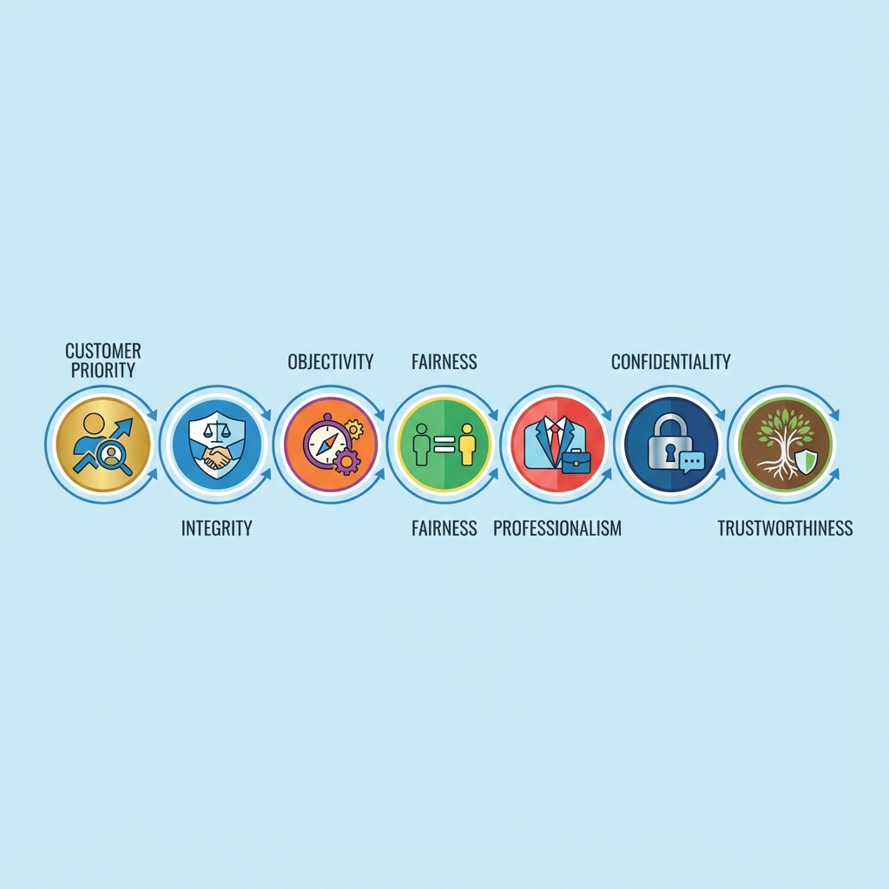

# FP1級取得への道 第1回

## FPの心構えと倫理

信頼されるプロフェッショナルになるための必修科目

---

## なぜ倫理が最初か？

### 倫理はFPの魂

#### FPの本質
- **単なるお金の専門家ではない**
- **お客様の人生と深く関わる信頼性の高い職業**

#### 真のプロフェッショナルとは？
- 高度な知識や技術
- **何よりも倫理観が必須**

---

## FP倫理綱領の概要

### FP倫理綱領
#### 七つの基本原則

**日本FP協会が定めるFP技能士が守るべき指針**

- 単なる規則ではなく
- **信頼されるFPとして活動するための羅針盤**

---

## FP倫理綱領：七つの原則

1. **顧客利益最優先の原則**
2. **誠実性の原則**
3. **客観性の原則**
4. **公正性の原則**
5. **専門性の原則**
6. **秘密保持の原則**
7. **信頼性の原則**

---

## 1. 顧客利益最優先の原則

### 核心
**常に顧客の利益を第一に考え、行動する**

### 実践的な意味
- ✅ 自身の利益（手数料、販売目標）より顧客利益を優先
- ✅ 商品を売るためではなく、顧客ニーズに合った提案
- ✅ 複数選択肢を提示し、最適なものを共に選ぶ

### 試験対策
- 利益相反の識別練習
- 「顧客利益最優先」の具体的内容の理解

---

## 2. 誠実性の原則

### 核心
**公正、誠実、忠実に行動する**

### 実践的な意味
- ✅ 虚偽の説明や誇大広告をしない
- ✅ 自分の能力の限界を正直に伝える
- ✅ 約束したことは必ず守る

### 試験対策
- 説明義務違反との関連
- 適合性原則違反との関連
- 不当表示防止法との関連

---

## 3. 客観性の原則

### 核心
**偏見や先入見なく、客観的な事実に基づき判断する**

### 実践的な意味
- ✅ 感情的判断ではなく、データに基づいた分析
- ✅ 好き嫌いで商品選択をしない
- ✅ 最新の情報を常に取り入れ、知識を更新

### 試験対策
- 情報収集と分析のプロセス
- 継続教育の必要性

---

## 4. 公正性の原則

### 核心
**公平な立場で、いかなる差別もなく対応する**

### 実践的な意味
- ✅ 顧客属性（年齢、性別、資産額）による差別をしない
- ✅ 複数顧客間で不公平な扱いをしない
- ✅ 自社商品と他社商品の公平な比較

### 試験対策
- 利益相反管理の具体的方法
- フルオープンアーキテクチャ（商品中立）の理解

---

## 5. 専門性の原則

### 核心
**専門能力を維持・向上させ、適切なサービスを提供する**

### 実践的な意味
- ✅ 常に最新の法令・税制・商品知識を学ぶ
- ✅ 自分の専門分野と得意分野を明確にする
- ✅ 必要に応じて他専門家（税理士、弁護士）と連携

### 試験対策
- 継続教育（CE）の重要性
- FP業務の限界と専門家連携

---

## 6. 秘密保持の原則

### 核心
**顧客の情報を厳重に管理し、秘密を守る**

### 実践的な意味
- ✅ 財務情報や個人情報を第三者に漏らさない
- ✅ 業務上必要な場合以外は情報を共有しない
- ✅ 保管データのセキュリティ管理

### 試験対策
- 個人情報保護法との関連
- 情報共有の例外ケース（法令開示など）

---

## 7. 信頼性の原則

### 核心
**プロフェッショナルとしての信頼を維持する**

### 実践的な意味
- ✅ 言動の一貫性を保つ
- ✅ 社会的信用を損なう行動をしない
- ✅ 誤解を招くような態度をとらない

### 試験対策
- 広告規制との関連
- SNS時代の情報発信の注意点

---

## 利益相反管理：実践的な対応策

### 利益相反とは？
- **FPが直面する最もデリケートな問題**
- 自身の利益と顧客利益が衝突する状況

---

## 典型的な利益相反ケース

### 1. 手数料の種類による影響
- フロントロード（初年度手数料） vs ノーロード
- 成功報酬 vs 時間給
- 自社商品限定 vs フルオープン

### 2. 金融機関所属FPの立場
- 営業目標との兼ね合い
- 提携商品の優先推奨
- 上位指示と顧客利益の相反

### 3. インセンティブとの関係
- 製造業者からの旅館招待
- 販促キャンペーンとの連動
- 社内表彰制度の影響

---

## 利益相反管理の具体的手法

### 1. 情報開示の徹底
- 🔍 手数料体系の透明化
- 🔍 利益相反可能性の事前説明
- 🔍 複数選択肢の提示

### 2. 社内体制の整備
- 🏢 コンプライアンス部門の設置
- 🏢 定期的な倫理研修
- 🏢 内部監査の実施

### 3. 客観的プロセス確立
- 📋 商品選定基準の文書化
- 📋 プロポーザル標準化
- 📋 第三者評価の導入

---

## FP業務関連法令

### 知っておべき主要法律
1. **金融商品取引法**
2. **金融サービスの提供に関する法律**
3. **民法（委任・準委任）**
4. **個人情報保護法**

---

## 金融商品取引法

### 目的
- 金融商品取引業者の行規制
- 投資家保護

### FPが知っておべきポイント
- ⚖️ **適合性原則（第40条）**
  - 顧客の知識、経験、財産状況に応じた勧誘
- ⚖️ **説明義務（第37条）**
  - 重要事項の説明義務
- ⚖️ **禁止行為**
  - 不招致勧誘、断定的判断の提供など

---

## 金融サービスの提供に関する法律

### （旧：金融商品の販売等に関する法律）

### 重要ポイント（試験頻出）
- ⚠️ **名称変更**（2021年）
  - 旧名称での出題経緯も理解が必要
- ⚠️ **重要事項の開示義務**
  - リスク等の重要事項説明なし → 損害賠償責任
- ⚠️ **損害賠償責任**
  - 無過失責任に近い厳しい責任
  - 元本欠損額が損害額と推定される

---

## 実践的な倫理判断：ケーススタディ

---

## ケース1：手数料と顧客利益の衝突

### 状況
- 顧客Aさんにはノーロード投信が適切
- しかし、FPは手数料あり投信を推奨したい
- 理由：会社の営業目標達成のため

### 倫理的判断
- ❌ **明らかに顧客利益最優先の原則に違反**
- ❌ **適合性原則違反の可能性**
- ✅ **正しい対応**：
  - ノーロード投信のメリットを説明
  - 最適な選択を支援

---

## ケース2：知識不足のケース

### 状況
- 顧客から複雑な相続税対策の相談
- FP自身は相続税に詳しくない
- しかし、相談料を逃したくない

### 倫理的判断
- ❌ **無理に対応することは顧客不利益**
- ✅ **専門性の原則より**：
  - 得意でない分野は他の専門家へ紹介
- ✅ **正しい対応**：
  - 相続税専門の税理士を紹介

---

## ケース3：情報漏洩のリスク

### 状況
- 顧客Bさんの財務情報が非常に機密性が高い
- 同僚から「参考程度に」と聞かれる
- FPは同僚との関係も良好に保ちたい

### 倫理的判断
- ❌ **守秘義務違反は絶対に不可**
- ✅ **秘密保持の原則は絶対**
- ✅ **正しい対応**：
  - 守秘義務を説明
  - 情報提供を断る

---

## FP1級試験での出題傾向と対策

### 過去問分析（直近5年間）

### 出題パターン
1. 倫理規定の文言穴埋め問題（約30%）
2. 事例からの倫理違反識別問題（約40%）
3. 利益相反管理の具体策問題（約20%）
4. 関連法令の知識問題（約10%）

### 頻出事例
- 💼 手数料体系を巡る利益相反
- 💼 適合性原則違反の具体例
- 💼 説明義務不履行のケース
- 💼 秘密保持義務違反の境界線

---

## 効率的な学習方法

### 1. 七原則の完全暗記
- 🔖 それぞれの原則のキーワードを覚える
- 🔖 原則間の関連性を理解
- 🔖 具体的な行動規範と結びつける

### 2. 事例問題の練習
- 🔖 過去問で典型的な違反パターンを学ぶ
- 🔖 自分で違反ケースを作成してみる
- 🔖 なぜ違反なのかを明確に説明できるように

### 3. 関連法令の整理
- 🔖 主要な法律の条文の概要を把握
- 🔖 FP業務との関連性を理解
- 🔖 最新の改正点をチェック

---

## お客様との信頼関係構築

## 倫理的行動の実践

### 初回面談での信頼構築
1. **透明性の確保**
   - 手数料体系の明確な説明
   - 得意分野と限界の共有
   - 利益相反の可能性があれば事前開示

2. **傾聴の姿勢**
   - お客様の話を遮らずに聞く
   - 価値観や不安の理解に努める
   - 一方的な提案を避ける

---

## 継続的関係の維持

### 1. 定期的な見直し
- 🔄 ライフプランの進捗確認
- 🔄 変化したニーズの把握
- 🔄 最適解の再提案

### 2. プロとしての継続学習
- 📚 最新の金融・税制情報の収集
- 📚 新商品の特性の把握
- 📚 顧客ニーズの変化への対応

---

## まとめ：倫理はFPの生命線

### 重要ポイント再確認
1. **七原則はFP活動の基本**、常に顧客利益を最優先
2. **利益相反は適切な管理と開示**で対応
3. **関連法令の理解**はプロとして当然の義務
4. **倫理的行動は信頼関係構築**の礎

---

## 学習チェックリスト

### 今日の確認事項
- [ ] FP倫理綱領の七原則を完全に暗記した
- [ ] 典型的な利益相反ケースと対応策を理解した
- [ ] 主要な関連法規の概要を把握した
- [ ] 過去5年分の倫理関連問題を解いた

---

## 次回予告

### 【財務分析編】
# 家計の見える化～キャッシュフロー表作成の極意～

お客様の財務状況を正確に把握し、可視化する技術を学びましょう

---

## 参考文献

- 日本FP協会「FP倫理綱領」
- 金融庁「金融商品の販売等に関する法律」ガイドライン
- FP技能検定試験過去問題集（直近5年分）

---

## 注意事項

※本資料は2025年現在の法令・制度に基づいています
試験対策の際は、最新の試験要綱や公式テキストで必ず確認してください

---

# ご清聴ありがとうございました

### ご質問はありますか？