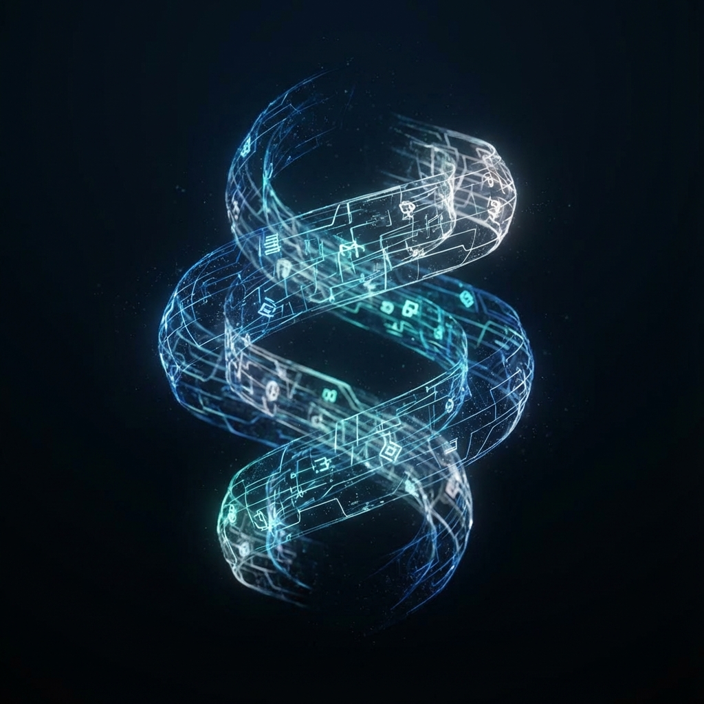
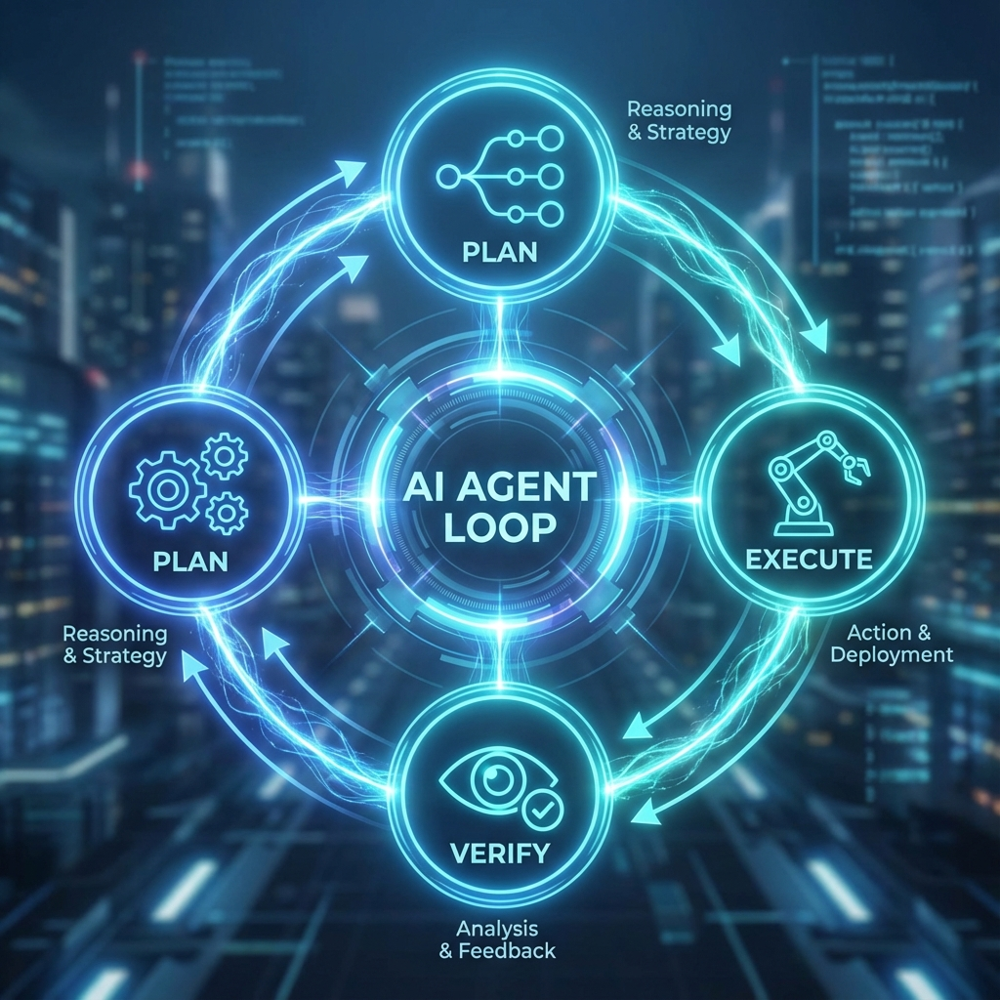

# Antigravity: Google Deepmindが贈る、次世代の自律型AIコーディングパートナー

ソフトウェア開発の世界において、私たちは常に「効率化」という名の聖杯を追い求めてきました。より速く、よりバグの少ないコードを書くこと。それは、開発者にとって永遠のテーマです。

近年、AIの進化は目覚ましく、コード補完やチャットボットによる支援は当たり前のものとなりました。しかし、私たちはまだ満足していません。なぜなら、それらはあくまで「道具」であり、私たちの指示を待つ受動的な存在だからです。

私たちが真に求めていたのは、単なる道具ではなく、共に考え、共に手を動かす「パートナー」です。開発者の意図を深く理解し、複雑な環境を自律的に操作し、困難な課題を共に解決してくれる存在。

それが、Google Deepmindチームによって開発された、次世代のAgentic AIコーディングアシスタント、**Antigravity**です。

この記事では、AntigravityがどのようにこれまでのAIと異なるのか、そしてそれが私たちの開発体験をどのように変革するのかを、詳細に解説します。

---

## AIコーディングの進化：補完から「代行」へ

これまでのAIコーディングツールの進化を振り返ってみましょう。

第1世代は「オートコンプリート」でした。IDEが変数名やメソッド名を予測し、タイピングの手間を省いてくれました。これは便利でしたが、あくまで局所的な支援に過ぎませんでした。

第2世代は「チャットボット」です。ChatGPTやClaudeのようなLLM（大規模言語モデル）が登場し、私たちは自然言語でコードの生成を依頼できるようになりました。「この関数を書いて」「このバグの原因は？」といった質問に対し、AIは驚くべき精度で答えを返してくれます。しかし、そこには大きな壁がありました。AIはコードを生成することはできても、それをファイルに保存したり、実行してテストしたりすることはできませんでした。結局、人間がAIの回答をコピー＆ペーストし、動作確認を行う必要があったのです。

そして今、私たちが足を踏み入れようとしているのが、第3世代「**Agentic AI（自律型AI）**」の時代です。

Antigravityは、この第3世代を象徴する存在です。それは単にテキストを生成するだけでなく、**行動**します。あなたの開発環境（IDE）の中に住み、ファイルシステムを操作し、ターミナルでコマンドを叩き、ブラウザでドキュメントを調べる。これまで人間が手作業で行っていた「エンジニアリング」のプロセスそのものを、AIが代行するのです。

## Antigravityの核心："Agentic Mode"

Antigravityの最大の特徴であり、魔法とも言える機能が **Agentic Mode** です。

あなたが「このリポジトリの認証機能をOAuth2に置き換えて」というような、抽象的で複雑なタスクを依頼したとします。従来のチャットボットなら、OAuth2の実装例をコードブロックで提示して終わりでしょう。

しかし、Antigravityは違います。

### 1. 計画（Planning）
まず、Antigravityはあなたのコードベース全体をスキャンし、現状の実装を理解します。どのファイルが認証に関わっているか、依存ライブラリは何か、既存のテストはあるか。それらを把握した上で、`task.md` というタスクリストを作成します。

*   [ ] 現状の認証ロジックの解析
*   [ ] 必要なライブラリのインストール
*   [ ] 認証プロバイダーの設定ファイル作成
*   [ ] ログイン画面のUI修正
*   [ ] 既存テストの修正と新規テストの追加

このように、大きな目標を実行可能な小さなステップに分解し、あなたに「この計画で進めていいですか？」と確認を求めます。

### 2. 実行（Execution）
計画が承認されると、Antigravityは実際の作業を開始します。

*   **ファイル操作**: 必要なファイルを新規作成したり、既存のファイルを編集したりします。単なる上書きではなく、コードの文脈を理解した上で、適切な箇所に適切な変更を加えます。
*   **ターミナル操作**: `npm install` でライブラリを追加したり、サーバーを起動して動作を確認したりします。エラーが出れば、そのログを読み取り、自律的に修正を試みます。
*   **ブラウザ操作**: 最新のドキュメントが必要な場合は、Web検索を行い、公式ドキュメントを参照して実装に反映させます。

### 3. 検証（Verification）
コードを書くだけでは終わりません。Antigravityは、変更が正しく機能しているかを検証します。テストコマンドを実行し、全てのテストがパスすることを確認します。必要であれば、ブラウザを立ち上げて実際の画面操作をシミュレーションすることさえあります。

この「計画 → 実行 → 検証」というループを回し続けることで、Antigravityは人間のエンジニアと同じように、試行錯誤しながらゴールへと向かうのです。

## なぜ "Antigravity" なのか？

開発者なら誰しも、コーディングにおける「重力」を感じたことがあるはずです。

*   環境構築で謎のエラーにハマり、数時間を浪費する。
*   ライブラリのバージョン不整合に悩まされる。
*   単純だが大量にあるボイラープレートコードを書く。
*   レガシーコードの仕様を調査するために、何十ものファイルを読み解く。

これらは、本来私たちが成し遂げたい「創造的な課題解決」を妨げる、重たい足枷です。Antigravityという名前には、**こうした開発のフリクション（摩擦・抵抗）を取り除き、開発者を重力から解放したい**という強い願いが込められています。

Antigravityが面倒な作業を引き受けてくれるおかげで、あなたはより高次の設計、ユーザー体験、ビジネスロジックといった、人間にしかできない創造的な領域に集中することができるようになります。

## 具体的なユースケース

Antigravityは、日常の様々な開発シーンでその力を発揮します。

### ケース1：レガシーコードのリファクタリング
「この古いクラスコンポーネントを、React Hooksを使った関数コンポーネントに書き換えて」
Antigravityは、コンポーネントのロジックを解析し、`useState` や `useEffect` を適切に使って書き換えます。型定義の修正や、関連するテストの更新まで一貫して行います。

### ケース2：新機能のプロトタイピング
「株価を表示するダッシュボードを作って。デザインはモダンで、ダークモード対応で」
Antigravityは、Next.jsのプロジェクトをセットアップし、必要なコンポーネントを作成し、API連携の実装まで行います。さらに、`generate_image` ツールを使ってUIのモックアップを作成し、視覚的なイメージを共有しながら開発を進めることも可能です。

### ケース3：バグの調査と修正
「CIでテストが落ちているんだけど、原因を調べて直して」
Antigravityは、CIのログを解析し、エラーの原因となっているコードを特定します。そして、修正パッチを作成し、ローカルでテストを実行して修正されたことを確認します。

## 未来への展望

Antigravityはまだ始まったばかりです。Google Deepmindチームは、このエージェントがより深く、より広く開発プロセスに関与できる未来を描いています。

将来的には、Antigravityがチームの一員としてGitHubのIssueを自ら拾い、Pull Requestを作成し、コードレビューに参加するようになるかもしれません。あるいは、アプリアイデアを話すだけで、デプロイまで完了した状態でURLを渡してくれるようになるかもしれません。

しかし、どれほどAIが進化しても、主役は常に「あなた」です。Antigravityは、あなたの能力を拡張し、あなたのビジョンを最速で実現するための最強のパートナーであり続けます。

さあ、重力から解き放たれた開発体験を、今すぐ始めましょう。
Antigravityと共に、コードのその先へ。
